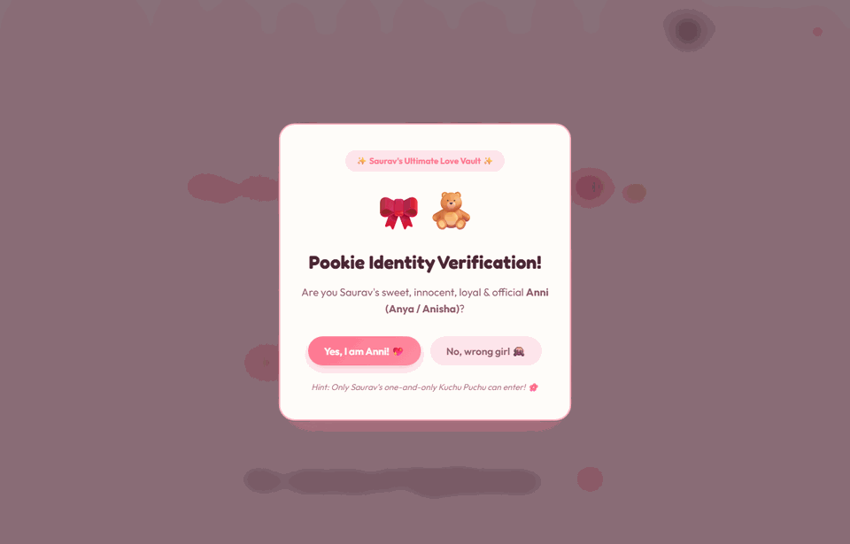
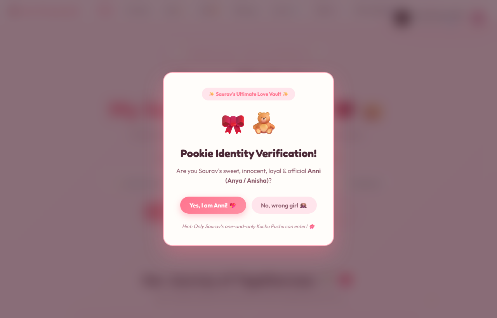
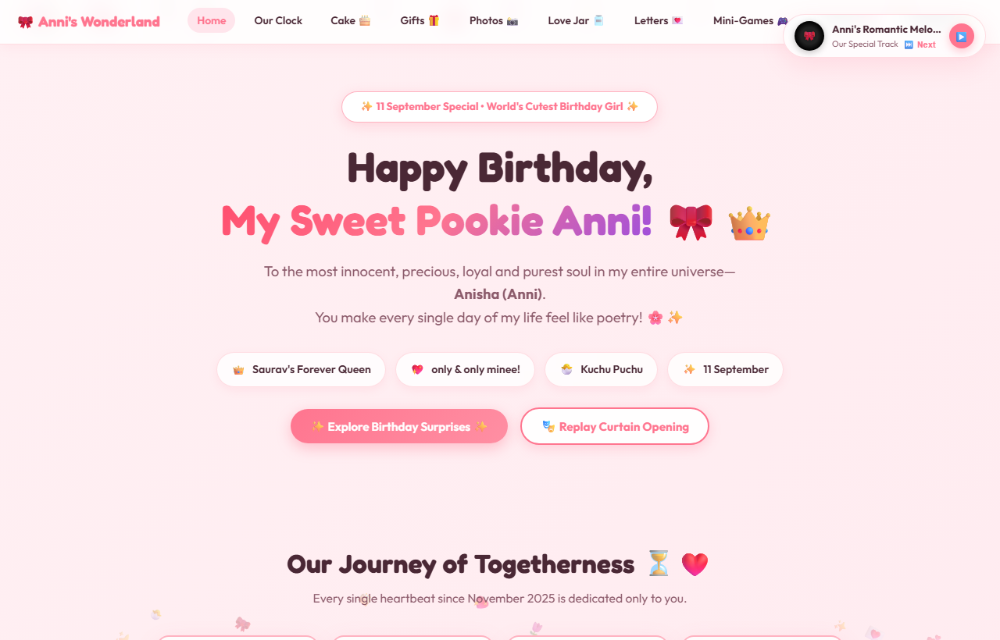
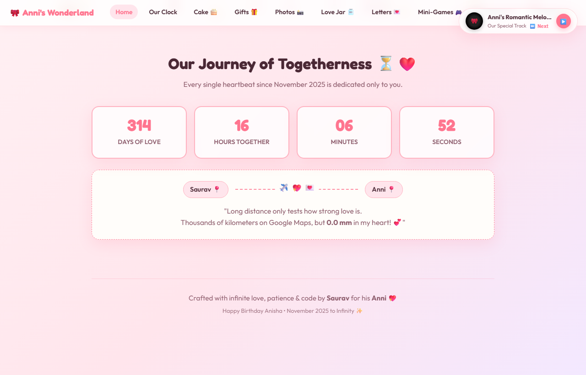
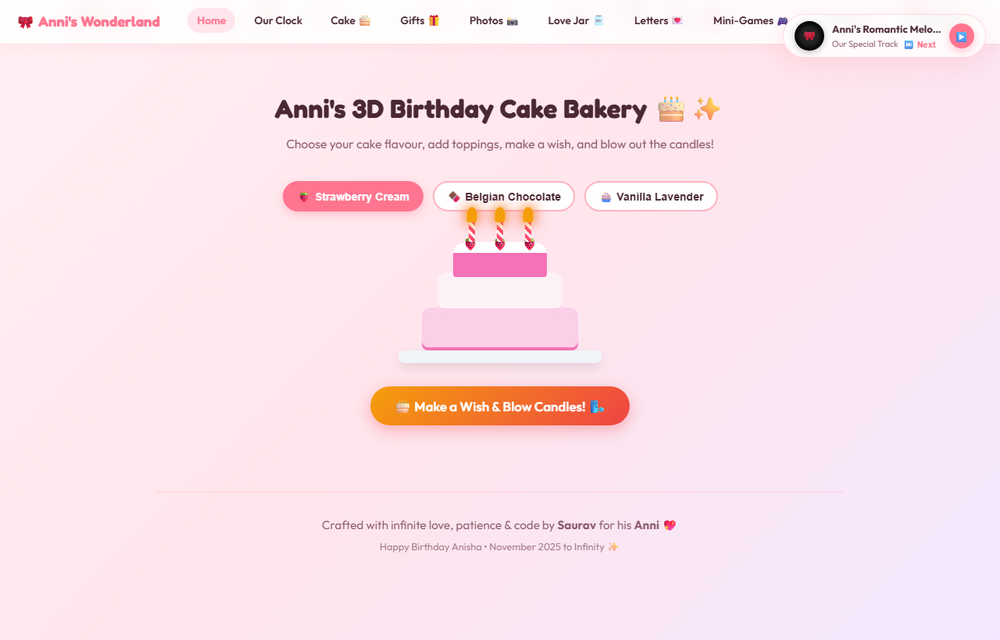
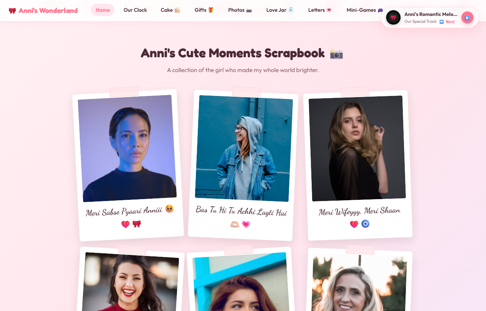
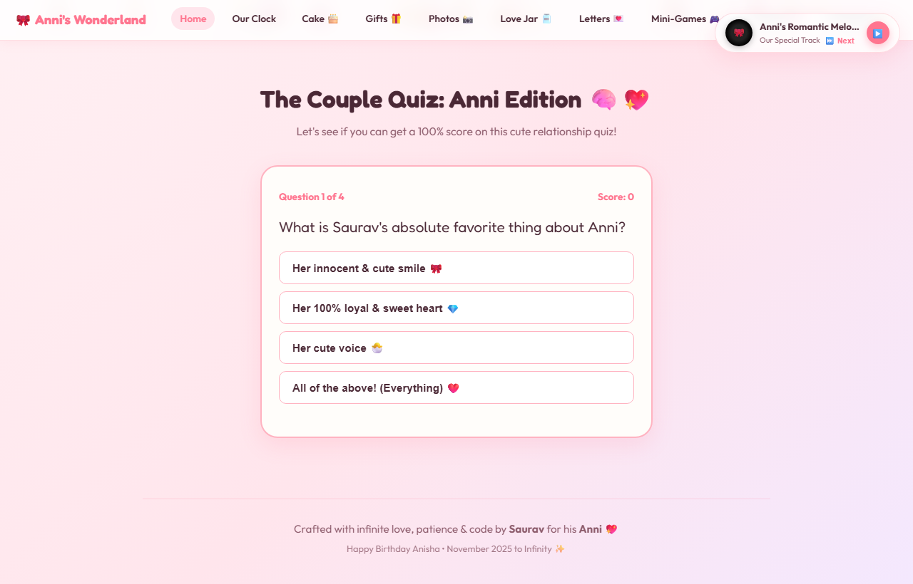
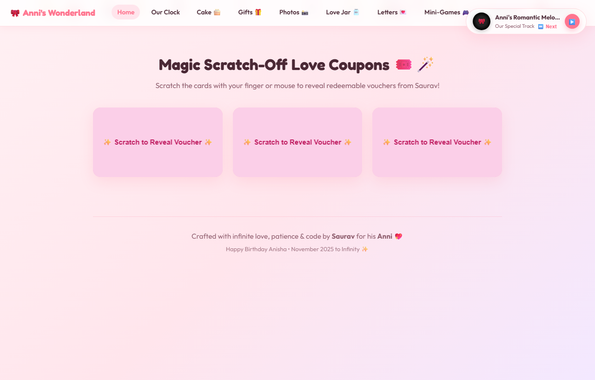
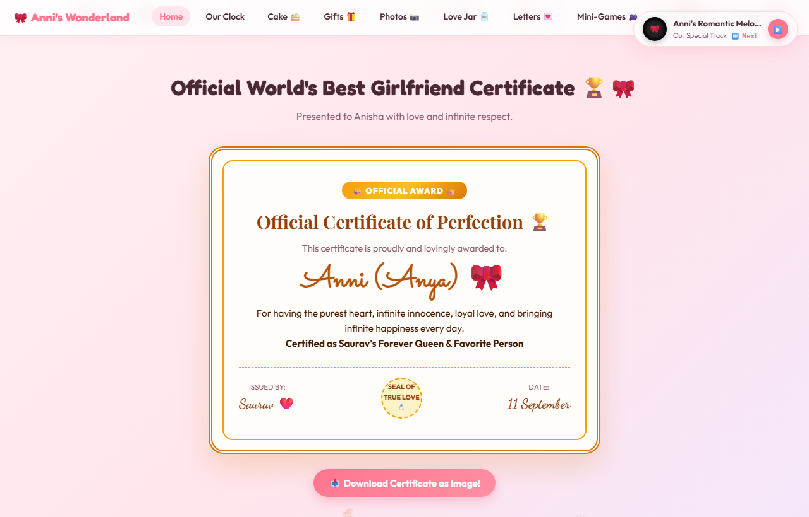

<div align="center">

# 🎀 Pookie Birthday Surprise Wonderland 🎂✨

### An aesthetic, romantic & interactive web experience crafted with love and micro-animations.

<br/>

[](https://th3-s4urav.github.io/pookie-birthday-surprise/)

<br/>

[](https://th3-s4urav.github.io/pookie-birthday-surprise/)
[](LICENSE)
[](https://th3-s4urav.github.io/pookie-birthday-surprise/)
[](https://github.com/TH3-S4URAV/pookie-birthday-surprise/pulls)

<p align="center">
  👉 <b><a href="https://th3-s4urav.github.io/pookie-birthday-surprise/">Click Here to Try the Live Demo in Your Browser</a></b> 👈
</p>

<!-- Animated Walkthrough Showcase -->
<p align="center">
  
</p>

</div>

---

## 🎬 Live Interactive Experience Highlights

<table align="center">
  <tr>
    <td align="center" width="50%">
      <b>🔐 Identity Verification & Curtains</b><br/><br/>
      <br/>
      <i>Runaway "No" button, password unlock & gold velvet curtain reveal</i>
    </td>
    <td align="center" width="50%">
      <b>🎀 Curtains Open & Romantic Hero</b><br/><br/>
      <br/>
      <i>Theatrical 3-2-1 chime countdown & sparkling love banner</i>
    </td>
  </tr>
  <tr>
    <td align="center" width="50%">
      <b>⏳ Togetherness Clock & Long Distance Radar</b><br/><br/>
      <br/>
      <i>Live Days:Hours:Mins clock and flight distance radar</i>
    </td>
    <td align="center" width="50%">
      <b>🎂 3D Cake Flavor & Candle Blow</b><br/><br/>
      <br/>
      <i>Flavour switcher, interactive candle blow & confetti bursts</i>
    </td>
  </tr>
  <tr>
    <td align="center" width="50%">
      <b>📸 Polaroid Scrapbook & Floating Jukebox</b><br/><br/>
      <br/>
      <i>Aesthetic washi-tape photo cards & spinning vinyl music player</i>
    </td>
    <td align="center" width="50%">
      <b>🎮 2D Catch The Hearts Mini-Game</b><br/><br/>
      <br/>
      <i>Catch falling hearts with touch/mouse + infinite love meter</i>
    </td>
  </tr>
  <tr>
    <td align="center" width="50%">
      <b>🎟️ Scratch-Off Love Vouchers & Jars</b><br/><br/>
      <br/>
      <i>Interactive scratch cards with coin sounds & open-when letters</i>
    </td>
    <td align="center" width="50%">
      <b>📜 Typewriter Letter & Certificate</b><br/><br/>
      <br/>
      <i>Real-time vintage typewriter typing & downloadable official award</i>
    </td>
  </tr>
</table>

---

## 🌟 Interactive Features Included

- 🔐 **Pookie Identity Verification Gate:** A cute verification screen with a runaway "No" button and confetti unlock.
- 🎭 **Theatrical Velvet Curtains & 3-2-1 Audio Countdown:** Luxury curtain drapes with gold fringe, chime sound effects, and a dramatic opening reveal.
- 🎵 **Floating Multi-Track Jukebox:** Spinning vinyl disc widget with track switcher and online romantic stream fallbacks.
- ⏳ **Live Togetherness Clock:** Real-time counter calculating Days, Hours, Minutes, and Seconds since your special date.
- 📍 **Long Distance Radar Card:** Interactive flight map with customized cities and distance quote.
- 🎂 **3D Virtual Cake Bakery:** Choose flavor (Strawberry, Chocolate, Vanilla), light candles, make a wish, and blow them out with fireworks confetti.
- 🎁 **3D Surprise Gift Unboxing:** Interactive ribbon unboxing animation revealing special love promises.
- 📸 **Polaroid Memory Lane:** Aesthetic tilted polaroid cards with washi-tape and automatic fallback photos.
- 🫙 **The Magical Pookie Jar:** Draw from a collection of cute, romantic, and heartfelt notes.
- 💌 **"Open When..." Secret Envelopes:** Interactive modal letters for different moments (*When You Miss Me*, *When You're Angry*, *When You Feel Low*, *Birthday Letter*).
- 🧠 **Couple Quiz Engine:** Interactive relationship quiz with real-time scoring and playful feedback.
- 🧺 **2D Mini-Game ("Catch Falling Hearts"):** Move your basket with touch or mouse to collect hearts in 30 seconds.
- 🎟️ **Magic Scratch-Off Coupons:** Scratch cards revealing custom redeemable vouchers (Ice Cream date, warm hugs, argument win pass).
- 📜 **Typewriter Love Letter:** Realistic letter typing animation with vintage parchment aesthetics.
- 🏆 **Official Certificate of Perfection:** Downloadable high-resolution certificate image (rendered via html2canvas).
- 🔮 **Love Meter & Proposal Box:** Interactive infinity love slider and proposal card with runaway button.

---

## 🔒 Privacy-First Design

This template is built so you can safely upload it to GitHub without exposing sensitive personal information:

1. **Centralized Configuration (`config.js`):** All names, dates, custom letters, quiz questions, and vouchers are separated into `config.js`.
2. **Built-in `.gitignore`:** Personal photos in `assets/images/`, personal MP3s in `assets/music/`, and optional private configs (`config.private.js`) are excluded from git tracking.
3. **Graceful Fallbacks:** If no personal photos or local music files are added, the app automatically serves curated aesthetic placeholders and royalty-free melodies.

---

## 🚀 Quick Start (Running Locally)

1. Clone or download this repository:
   ```bash
   git clone https://github.com/TH3-S4URAV/pookie-birthday-surprise.git
   ```
2. Open the folder and double-click **`index.html`** in your browser.
3. Done! The website opens instantly—no build steps or node installation required.

---

## 🛠️ How to Customize for YOUR Partner in 2 Minutes

Open **`config.js`** in any text editor (VS Code, Notepad, etc.) and update the values:

```javascript
const DEFAULT_SURPRISE_CONFIG = {
  partner: {
    name: "Priya",                     // Display name / nickname
    fullName: "Priya Sharma",          // Full name
    nicknames: "Priya (Piku / Cutie)", // Nicknames shown in headers
    petName: "Pookie",                 // Cute pet name
    birthdayDate: "25 October",        // Birthday date
    milestoneText: "Happy 20th Birthday"
  },

  sender: {
    name: "Rahul",                     // Your name
    title: "Forever Queen",            // Title given to partner
    signature: "~ With Love, Rahul 💖"
  },

  dates: {
    relationshipStart: "2024-02-14T00:00:00", // Start date (YYYY-MM-DDTHH:mm:ss)
    displayMonthYear: "February 2024"
  },

  locations: {
    senderCity: "Delhi 📍",
    partnerCity: "Mumbai 📍",
    distanceText: "1400 km on GPS, but 0 mm in heart 💖"
  },

  // Add custom love notes, quiz questions, scratch cards & letters!
};
```

### 📸 Adding Your Own Photos:
Save up to 6 pictures in `assets/images/` as:
- `photo1.jpg`, `photo2.jpg`, `photo3.jpg`, `photo4.jpg`, `photo5.jpg`, `photo6.jpg`

*(Note: `.png`, `.jpeg`, and `.webp` formats are also automatically supported!)*

### 🎶 Adding Your Favorite Song:
Place your romantic song in `assets/music/` and name it:
- `romantic_lofi.mp3`

---

## 🌐 Free 1-Click Hosting Guide

### Option 1: GitHub Pages (Free & Recommended)
1. Fork or push this repository to your GitHub account.
2. Go to your repo **Settings** > **Pages**.
3. Under **Branch**, select `main` (or `master`) and folder `/ (root)`.
4. Click **Save**! Within 1-2 minutes, you will get a live link (e.g. `https://your-username.github.io/pookie-birthday-surprise/`).

### Option 2: Netlify Drop (1 Minute)
1. Visit [Netlify Drop](https://app.netlify.com/drop).
2. Drag and drop your project folder onto the page.
3. Instant live link ready to share on WhatsApp or Instagram!

### Option 3: Vercel (Fast & Smooth)
1. Visit [Vercel](https://vercel.com).
2. Click **Add New Project** > Import this GitHub repository.
3. Click **Deploy**!

---

## 📁 Project Structure

```text
pookie-birthday-surprise/
├── assets/
│   ├── images/            # Personal photos (git-ignored for privacy)
│   └── music/             # Background music tracks (git-ignored for privacy)
├── config.js              # Central personalization configuration
├── config.example.js      # Template example for new users
├── index.html             # Semantic responsive HTML5 structure
├── style.css              # Aesthetic pastel CSS with luxury micro-animations
├── script.js              # Interactive JavaScript engine
├── .gitignore             # Protects private media and custom overrides
├── LICENSE                # MIT Open Source License
└── README.md              # Project documentation
```

---

## 💖 Contributing & Feedback

Contributions, suggestions, and feature requests are welcome!
Feel free to open an [Issue](https://github.com/TH3-S4URAV/pookie-birthday-surprise/issues) or submit a Pull Request.

If this project made your loved one smile, consider giving it a ⭐️ on GitHub!

---

## 📜 License

This project is licensed under the **MIT License** - see the [LICENSE](LICENSE) file for details.
Feel free to use and customize it for your special celebrations!
